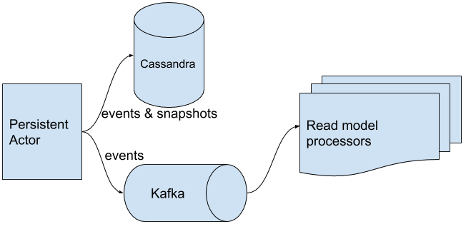
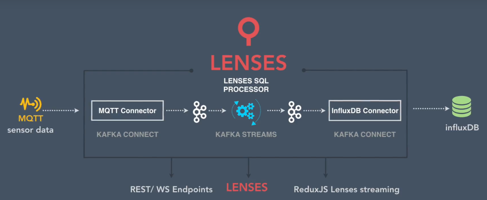
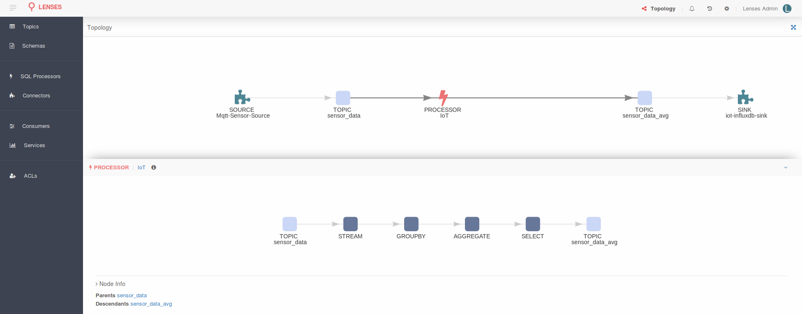
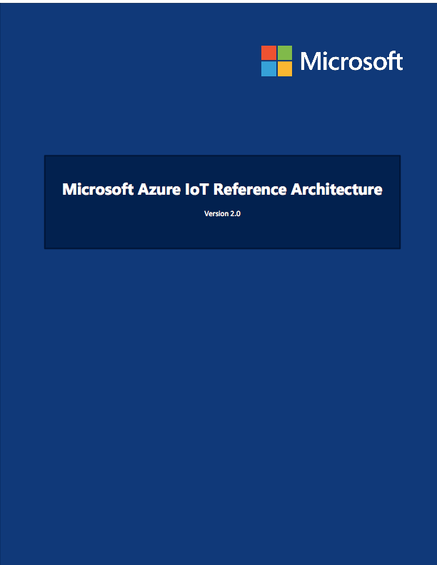

# IOT Application 

Intention is to build an end-to-end data pipeline.

Akka Persistence Algorithm. 

1. receive command
2. save event(s)
3. update state
4. send event(s) to Kafka

To secure events order, sending to Kafka must block the whole actor, which is of course a bad idea, since it will degrade Persistent Actor performance. We could delegate Kafka producer to a separate child actor (let’s call it `KafkaSender`). Awesome, but then we must ensure messages delivery between actors. This could be done by using `AtLeastOnceDelivery` trait. You probably sense that nothing is for free. Exactly, more messages are circulating in our cluster and we loose the order:

[https://www.eclipse.org/hono/](https://www.eclipse.org/hono/) 

[https://github.com/kaaproject/kaa/](https://github.com/kaaproject/kaa/)  Platform. 

[https://www.eclipse.org/kapua/index.php](https://www.eclipse.org/kapua/index.php) Platform 

Imagine a vast network of sensors pushing various measures via the MQTT protocol to a Mosquitto cluster. Using the entire Apache Kafka ecosystem, the data is first imported into topics via Kafka Connect, then Kafka Streams comes into play to analyze the stream(s) of data, and the results are then pushed into an instance of InfluxDB via Kafka Connect.

We leverage Apache Kafka to deliver events from where they are created to further downstream systems where they can be processed or queried. Kafka has great properties that allows us to decouple event producers from event consumers and ensure our events are always delivered.

[http://insights.mindstix.com/mqtt-a-protocol-for-the-internet-of-things/](http://insights.mindstix.com/mqtt-a-protocol-for-the-internet-of-things/) 

[http://insights.mindstix.com/understanding-the-key-features-of-iot-cloud-platforms/](http://insights.mindstix.com/understanding-the-key-features-of-iot-cloud-platforms/)

[http://insights.mindstix.com/protocol-design-challenges-for-iot/](http://insights.mindstix.com/protocol-design-challenges-for-iot/) 

[http://insights.mindstix.com/understanding-the-key-features-of-iot-cloud-platforms/](http://insights.mindstix.com/understanding-the-key-features-of-iot-cloud-platforms/) 

[https://www.slideshare.net/helenaedelson/patterns-in-the-chaos](https://www.slideshare.net/helenaedelson/patterns-in-the-chaos) 

## Architectural Design Patterns for an IoT Platform

## Pattern 1: Data Ingestion

IoT solutions require the ability to ingest events and data generated by IoT devices. Solution should have capabilities to ingest such real-time telemetry data at a *massive scale* (i..e. millions, or even billions of messages) and yet stay *highly performant* (i.e. low latency to accept and persist messages).

> Design the ability to ingest and persist massive amounts of telemetry data via a primary ‘data channel’ in your IoT solution.

## Pattern 2: Control Channel

Most web architectures adopt a Request-Response model of communication: The client sends a request to a service, and receives a response in return. While immensely useful, this model does not suffice for IoT applications.

IoT solutions need the ability to send commands and notifications to IoT Devices in real time. We need a two-way communication channel with the following characteristics:

- The solution should allow either party to initiate communication.
- The channel should also offer guarantees to ensure delivery of commands (i.e. Resilience against packet drops etc.)
- Extensibility to support new commands in the future as the solution evolves.
- Ensure that commands are delivered securely with sufficient mutual authorizations.

Protocols such as MQTT are well suited to act as such a ‘control channel’ with Quality of Service (QoS) guarantees for message delivery.

> Design for a secure, two-way, control channel which can be initiated by either the Device or by the Cloud. Ensure ‘at least once’ delivery semantics for messages in this control channel.

## Pattern 3: Loose Coupling

IoT devices often encounter intermittent connectivity in their wireless networks. Also, devices sometimes suspend their radio interfaces or hibernate entirely in order to conserve power.

The IoT communication channels hence need a asynchronous model of communication. Messages and commands should be queued for delivery if a device is intermittently disconnected or is in a sleep mode.

Moreover, the set of devices deployed in the field changes with time: A temperature sensor may not know who the exact recipient of its telemetry information is. It may be one or more existing thermostats, or new thermostats and services in the future.

IoT communication channels hence require a loose-binding between the message senders and recipients. A topic-based, multicast communication is a very useful model to consider in your solution design.

## Pattern 4: IoT Gateway

Lightweight IoT devices often operate within a PAN (Personal Area Network) using protocols such as Zigbee, Z-Wave, or BLE. These protocols do not support an IP stack to communicate directly with the IoT Cloud over WAN.

An IoT Gateway is an intermediate device that communicates with sensors and actuators using low-level protocols. It further offers the ability to connect with your IoT Cloud using IP-based protocols.

The Gateway offers capabilities such as sanitization of telemetry data, aggregation and edge-analytics of telemetry data.

> Devices which do not support the IP stack will integrate using an IoT Gateway.

## Pattern 5: Business Rules Engine

Once ingested, we need to run business rules on this data to derive control decisions and business insights. This could be done at two points in time:

## The Hot Path

Ability to run business rules on real-time data streams. This enables our IoT platform to take spontaneous decisions, route information, or control objects in real-time. For example, if a temperate threshold of the furnace is crossed, we need to recalibrate the heating system with immediate effect.

## The Cold Path

This involves offline data processing on the persisted telemetry data. For example, aggregating the temperature over the period of last three months to determine the average temperature of the furnace.

> Provide an ability to process data streams in real-time, or to process them post-facto.

## Pattern 6: Heartbeat

IoT devices tend to fall off the grid from time to time. This may be due to battery outages, network outages, hardware failures etc. Devices should send a ‘heartbeat’ to the Cloud platform from time-to-time which includes information about the internal health of the device.

> Design devices to periodically send a heartbeat or a keep-alive signal to your IoT Cloud.

## Pattern: Canary Firmware Releases

Most IoT solutions require the ability to remotely upgrade firmware running on your devices. The firmware needs to be securely downloaded, and verified for integrity before replacing the older firmware on the device.

Moreover, firmware upgrades should be incrementally rolled-out, instead of being pushed to all devices at once. This helps limit the risksdue to a faulty firmware release, as well as reduces the burden on your Cloud infrastructure when devices attempt to download the new firmware.

> Ability to incrementally roll out firmware upgrades to manage risks of new software releases.

## Pattern 8: Unified Endpoint Management

Ability to manage endpoint devices remotely – a dashboard and a set of APIs to be able to do this task.

## Pattern 10: Device Authorization

Web or Mobile applications typically authenticate users with credentials (User Name and Password). IoT devices are often headless and offer no means to provide such credentials.

IoT devices often use client certificates to authorize themselves with the IoT Cloud.

> Use client certificates for device authorization. Make sure the client private keys are stored in a secure key-chain on the device.

# Pattern 11: State Synchronization

This is similar to the concept of Device Shadows offered by platforms like the Amazon AWS IoT. It created a representation of the device ‘state’ as an object in the Cloud. Web and Mobile applications can then interact with this device ‘state’ in the Cloud to manipulate the state. These changes are then synchronized with the real world object.

> Provide a ‘state’ object which mirrors the real-world state of your device.

## Pattern 12: Device Registry

IoT solutions need to keep a track of all deployed devices and information about them such as – device identifiers, device certificates, device configuration etc. A device registry provides such a capability.

